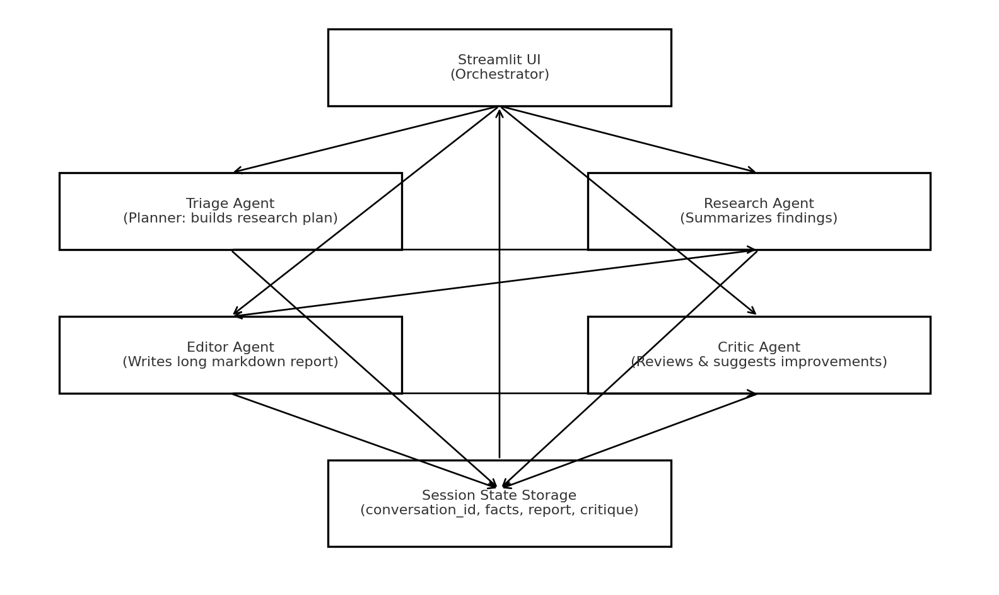

# Gemini Multi‑Agent Researcher (Streamlit)

This project implements a **multi‑agent, AI‑powered research helper** using **Google Gemini** and **Streamlit**.  
The system coordinates **four collaborative agents** to produce a comprehensive research report from a user‑provided topic.

---

## 📌 Problem Statement

Online research is fragmented and time‑consuming. Users need:
- A clear **research plan** before diving in
- **Concise findings** without fluff
- A **long, structured, evidence‑backed report**
- A quick **quality review** to catch gaps

This app solves that by orchestrating four agents that plan, research, write, and review—end to end, in one UI.

---

## 🧩 Architecture



**Components**
- **Streamlit UI (Orchestrator):** Collects user topic, triggers the workflow, and renders outputs.
- **Triage Agent (Planner):** Produces a structured research plan (topic, 3–5 search queries, 3–5 focus areas).
- **Research Agent (Finder):** Creates a concise 2–3 paragraph summary of findings (<300 words).
- **Editor Agent (Writer):** Generates a long‑form markdown report (≥ 1000 words) with outline and sources.
- **Critic Agent (Reviewer):** Reviews the report for clarity, structure, coverage, and suggests fixes.
- **Session State Storage:** Persists conversation id, collected findings, the final report, and critique.

---

## 🔄 Collaboration Flow

1. **Triage Agent** builds a JSON research plan from the user topic.  
2. **Research Agent** turns the plan into concise findings.  
3. **Editor Agent** transforms findings into a detailed, well‑structured markdown report.  
4. **Critic Agent** evaluates the draft and returns a focused review with improvements.  
5. **UI** displays both the report and the critique with download options.

---

## 🧠 Models

- Default model: **`gemini-2.5-flash`** for all agents (fast, cost‑efficient, strong quality).
- You can upgrade the **Editor Agent** to `gemini-2.5-pro` for heavier reasoning if quota allows.

---

## 🚀 How to Run

### 1) Clone & install

```bash
git clone <your-repo-url>
cd <your-repo-folder>
python -m venv .venv
source .venv/bin/activate  # Windows: .venv\Scripts\activate
pip install -r requirements.txt
```

### 2) Configure API key

Create a `.env` file in the project root:

```env
GEMINI_API_KEY=your_api_key_here
```

> Get your key from: https://aistudio.google.com/app/apikey

### 3) Start the app

```bash
streamlit run app.py
```

Open the URL shown in the terminal (e.g., `http://localhost:8501`).

---

## 🧪 Using the App

1. Enter a **topic** in the sidebar.  
2. Click **Start Research**.  
3. Follow progress in **Research Process** tab.  
4. View the final **Report** and **Critic Review** in the **Report** tab.  
5. Download both as Markdown.

---

## 📁 Project Structure

```
.
├── app.py               # Streamlit app (multi-agent orchestration)
├── requirements.txt     # Python dependencies
├── .env.example         # Example environment file
├── README.md            # This documentation
└── architecture.png     # Generated diagram (this file)
```

> The app uses Streamlit **Session State** to avoid rerun issues and to persist outputs during interaction.

---

## ⚠️ Notes on Quotas & Errors

- If you see **429 (quota/rate limit)**, reduce calls, add retries/backoff, or enable billing for higher limits.
- If you see **404 model not found**, switch to a supported model ID (e.g., `gemini-2.5-flash`, `gemini-2.5-pro`).

---

## 🧩 Extending the App (Ideas)

- Add a **Summary Agent** for an executive 1‑page summary.
- Add a **Source Collector Agent** to fetch and cite URLs explicitly.
- Persist results to a DB (SQLite) for a research history.
- Allow exporting to PDF (e.g., via `reportlab`) including the architecture diagram.

---

## ✅ Requirements (requirements.txt)

```txt
streamlit>=1.34.0
google-generativeai>=0.7.2
python-dotenv>=1.0.1
pydantic>=2.7.1
matplotlib>=3.8.4
```

---

## 📝 License

MIT (adapt as needed)
